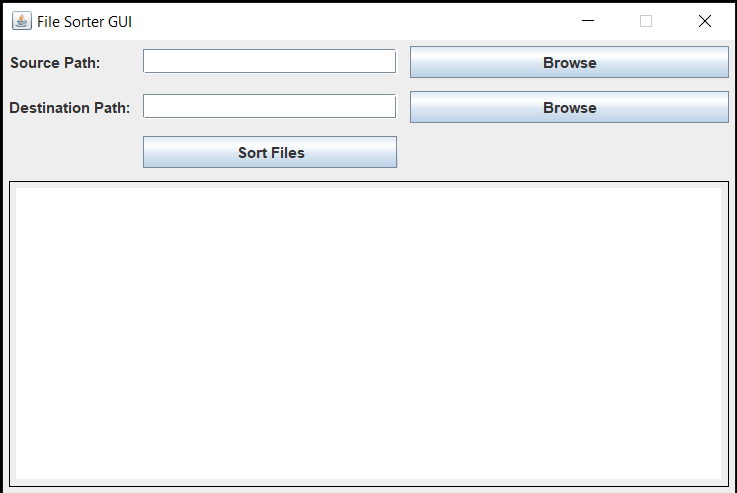

# FileSorter

FileSorter is a simple Java application for sorting files from a source directory into destination directories based on file extensions. It offers a user-friendly GUI for easy file organization.

## Features

- Browse for source and destination directories using the GUI.
- Automatically sorts files into subdirectories based on their file extensions.
- Provides a debugging window to track file sorting operations.

## Usage

1. Download the latest release from the [Releases](https://github.com/yourusername/FileSorter/releases) page.
2. Launch the application by double-clicking the JAR file (or the EXE if available).
3. Use the GUI to specify the source and destination directories.
4. Click the "Sort Files" button to start the sorting process.
5. Monitor the progress in the debugging window.
6. Receive a "Sorting complete" message when the process is finished.

## Screenshots

## System Requirements

- Java Runtime Environment (JRE) 8 or later.

## Build Instructions

If you want to build FileSorter from source, follow these steps:

1. Clone the repository.
2. Compile the source code: `javac FileSorter.java FileSorterGUI.java`
3. Create an executable JAR: `jar cfm FileSorterApp.jar manifest.txt *.class`

## Configuration

You can configure memory settings for the application by editing the `config.xml` file using Launch4j.

## License

This project is licensed under the MIT License. See the [LICENSE](LICENSE) file for details.

## Acknowledgments

- Thanks to [Launch4j](http://launch4j.sourceforge.net/) for creating a great tool for creating Windows executables from JAR files.

## Support and Contributions

Feel free to open issues and pull requests to contribute to the development of FileSorter.

For any questions or issues, please contact [koussay.hajri.tn@gmail.com](mailto:koussay.hajri.tn@gmail.com).

---

